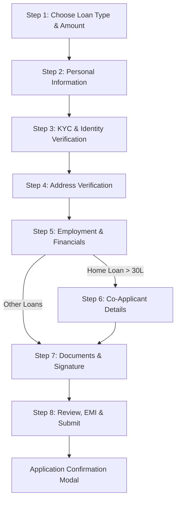

# LendSwift — Enterprise Digital Loan Application Platform

> A production-grade, accessible, multi-step digital loan application experience built for modern Indian FinTech lending.

[](https://react.dev)
[](https://www.typescriptlang.org/)
[](https://vitejs.dev/)
[](https://tailwindcss.com/)
[](#)

---

## 📑 Table of Contents

1. [Executive Overview](#-executive-overview)
2. [Supported Loan Products](#-supported-loan-products)
3. [8-Step Application Architecture](#-8-step-application-architecture)
4. [Key Engineering Highlights](#-key-engineering-highlights)
   - [Dynamic Multi-Step Wizard Engine](#1-dynamic-multi-step-wizard-engine)
   - [Cross-Step Schema Factory & Validation](#2-cross-step-schema-factory--validation)
   - [Real-World Indian KYC & Verhoeff Checksum](#3-real-world-indian-kyc--verhoeff-checksum)
   - [Encrypted Client-Side Auto-Save & Resume](#4-encrypted-client-side-auto-save--resume)
   - [Interactive Canvas E-Signature & Image Compression](#5-interactive-canvas-e-signature--image-compression)
   - [Financial Calculations & EMI Affordability](#6-financial-calculations--emi-affordability)
   - [PIN Code Geographic Lookup](#7-pin-code-geographic-lookup)
5. [Design System & Aesthetics](#-design-system--aesthetics)
6. [Accessibility (a11y) & UX Standards](#-accessibility-a11y--ux-standards)
7. [Repository Structure](#-repository-structure)
8. [Getting Started & Local Development](#-getting-started--local-development)
9. [Available Scripts](#-available-scripts)
10. [Production Build & Code Splitting](#-production-build--code-splitting)

---

## 🌟 Executive Overview

**LendSwift** is a high-performance digital lending frontend designed to simulate a real-world Indian non-banking financial company (NBFC) or fintech application. The application guides borrowers through a tailored loan onboarding journey with strict compliance, real-time validation, dynamic conditional branching, automated document processing, and financial eligibility calculations.

The platform eliminates cumbersome physical paperwork through an intuitive, accessible, and responsive multi-step wizard adhering to a curated monochromatic visual design language.

---

## 🏦 Supported Loan Products

LendSwift offers three distinct loan products, each with its own business rules, repayment tenures, interest rate slabs, and conditional document requirements:

| Parameter | Personal Loan | Home Loan | Business Loan |
| :--- | :--- | :--- | :--- |
| **Loan Amount Range** | ₹50,000 – ₹25,00,000 | ₹5,00,000 – ₹1,00,00,000 | ₹1,00,000 – ₹50,00,000 |
| **Repayment Tenure** | 12 – 60 months (1–5 yrs) | 60 – 240 months (5–20 yrs) | 12 – 84 months (1–7 yrs) |
| **Indicative APR** | 11.5% – 16.0% p.a. | 8.5% – 10.5% p.a. | 13.0% – 19.0% p.a. |
| **Processing Fee** | 1.5% – 2.5% | 0.5% – 1.0% | 2.0% – 3.0% |
| **Eligible Entities** | Individuals (`P`) | Individuals (`P`) | Prop, Partnership, Pvt Ltd (`P, C, F, B`) |
| **Mandatory Co-Applicant** | No (Optional) | **Required if Loan > ₹30,00,000** | No |
| **Special Identifiers** | Standard KYC | Passport required if > ₹50L | GSTIN (15-char registered format) |

---

## 🚀 8-Step Application Architecture



### **Step 1: Choose Your Loan**
- **Radio Card Selector**: Interactive cards with radio buttons for Personal, Home, and Business loans.
- **Dynamic Currency Input**: Formatted Indian Rupee entry (e.g., `₹50,00,000`) with boundary enforcement.
- **Dynamic Tenure Range**: Validated based on selected loan category.
- **Contextual Purpose Dropdown**: Options change dynamically according to the selected loan type (e.g., Home Renovation vs. Working Capital).
- **Optional Referral Code**: 6–10 character alphanumeric validation.

### **Step 2: Personal Details**
- **Strict Format Constraints**: Full name (minimum 2 words), valid email address.
- **Indian Mobile Validation**: 10-digit mobile number strictly starting with 6, 7, 8, or 9.
- **Age Gate Enforcement**: Date of birth validation enforcing borrower age between 21 and 65 years.
- **Gender & Marital Status**: Accessible dropdown selectors.

### **Step 3: KYC & Identity Verification**
- **Permanent Account Number (PAN)**:
  - Validates `AAAAA9999A` regex structure.
  - Checks 4th character entity type against allowed loan applicant types.
  - Interactive simulation calling mock NSDL verification with loading state and success badge.
- **Aadhaar Verification**:
  - Exactly 12 numeric digits with full **Verhoeff checksum algorithm** validation.
  - Simulated UIDAI e-KYC integration with masked display (`XXXX XXXX 1234`).
  - Mandatory legal Aadhaar consent checkbox.
- **Conditional Passport**: Automatically triggered for Home Loans exceeding ₹50,00,000.

### **Step 4: Address Details**
- **Current Residential Address**: Street, flat/unit, pin code, city, and state.
- **PIN Code Auto-Fill**: Real-time lookup fetching city, state, and post office.
- **Tenure at Address**: Years lived at current residence. If **less than 1 year**, an animated **Previous Address** block dynamically appears and is required.
- **Residence Type**: Owned, rented, company-provided, or family-owned. If rented, monthly rent amount is required.
- **Permanent Address Sync**: "Same as Current Address" toggle synchronizes address data and bypasses redundant input.

### **Step 5: Employment & Financials**
- **Employment Type Discriminated Union**: Salaried, Self-Employed, or Business Owner (Business Loans enforce Self-Employed or Business Owner only).
- **Salaried**: Employer name, designation, years of experience, and monthly net take-home salary.
- **Self-Employed / Business Owner**: Business name, entity structure, years in business, annual turnover, and average monthly income.
- **GSTIN**: 15-character Indian Goods & Services Tax identification number validation for registered businesses.

### **Step 6: Co-Applicant Details (Conditional Step)**
- **Dynamic Step Insertion**: Automatically injected into the wizard progression when a **Home Loan > ₹30,00,000** is detected.
- **Co-Borrower Information**: Full legal name, relationship (Spouse, Parent, Sibling), PAN, Aadhaar (with Verhoeff validation), and monthly income for joint eligibility.

### **Step 7: Documents & Digital E-Signature**
- **Smart Document Matrix**: Required documents update based on employment type and PAN electronic verification status.
- **Drag-and-Drop Uploader**: Supports PDF, JPEG, and PNG files with size cap warnings.
- **Client-Side Image Compression**: Automatic client-side canvas downsampling of large image uploads before state persistence.
- **Interactive E-Signature Canvas**: Full HTML5 touch and mouse signature pad with clear, redrawing, privacy overlay, and data URL restoration upon revisiting.

### **Step 8: Review & Pre-Approval Submission**
- **Comprehensive Summary**: Read-only breakdown of every previous step with quick "Edit" jumps.
- **Real-Time EMI Calculator**: Monthly EMI, total interest payable, and total cost calculated from financial formulas.
- **Affordability Indicator**: Evaluates estimated EMI against declared monthly income (< 50% Debt-to-Income ratio indicator).
- **Statutory Consent**: CIBIL credit pull authorization, terms agreement, and communication consent.
- **Submission**: Simulated async API submission with visual loading indicator, draft purging, and generation of a unique reference ID (e.g., `LS-2026-XXXX`).

---

## 🛠️ Key Engineering Highlights

### 1. Dynamic Multi-Step Wizard Engine
The wizard (`src/components/wizard/Wizard.tsx` and `StepRegistry.ts`) evaluates form state on every transition. Steps are represented as a reactive pipeline where visibility conditions (such as Step 6 co-applicant requirements) dynamically modify total step count, progress bar metrics, and forward/backward navigation routes without hardcoded step indices.

### 2. Cross-Step Schema Factory & Validation
Validation is powered by **Zod** paired with **React Hook Form**:
- Centralized `schemaFactory.ts` provides step-by-step schemas derived from cross-step state.
- `step1Schema` uses `.superRefine()` to evaluate min/max loan limits, tenures, and purposes directly against the active `loanType`.
- `step4Schema` uses `.superRefine()` to conditionally validate permanent addresses (only when `sameAsCurrent === false`) and previous addresses (only when `yearsAtAddress < 1`).

### 3. Real-World Indian KYC & Verhoeff Checksum
Rather than simplistic length checks, Aadhaar validation in [`src/utils/validators.ts`](file:///c:/Users/Aman/OneDrive/Desktop/Zetheta%20Internship/src/utils/validators.ts) executes the authentic **Verhoeff algorithm** utilizing multiplication ($D$), permutation ($P$), and inverse tables. This catches all single-digit transcription errors and adjacent transpositions.

```typescript
// Verhoeff dihedral group validation table verification
let c = 0;
const reversed = num.split('').reverse();
for (let i = 0; i < reversed.length; i++) {
  c = d[c][p[i % 8][parseInt(reversed[i], 10)]];
}
return c === 0;
```

### 4. Encrypted Client-Side Auto-Save & Resume
Borrower privacy and progress safety are paramount:
- **AES-256-GCM Encryption**: Auto-saved drafts are encrypted client-side using the native **Web Crypto API** (`SubtleCrypto`) with PBKDF2 key derivation before being committed to `localStorage`.
- **Session-Safe Passphrase**: Encryption key is persistently stored in `localStorage` so borrowers can close their browser, return 2 days later, and decrypt their saved draft.
- **Debounced Auto-Save**: Changes trigger a 2-second debounced save alongside a 30-second background heartbeat interval.
- **Draft Expiry**: Saved drafts older than 72 hours are automatically purged for data protection.
- **Seamless Resume Modal**: On app initialization, drafts are inspected asynchronously without flickering step 1.

### 5. Interactive Canvas E-Signature & Image Compression
- **Signature Restoration**: Hand-drawn signatures captured via `react-signature-canvas` are saved as base64 data URLs and automatically restored to the canvas pad upon navigation or draft recovery.
- **Privacy Mode**: Signature pad includes an automatic privacy blur shield when inactive.
- **Client-Side Compression**: The `compressImage` utility renders oversized images onto an offscreen canvas and downsamples them to optimal dimensions and quality.

### 6. Financial Calculations & EMI Affordability
Loan calculations in [`src/utils/calculations.ts`](file:///c:/Users/Aman/OneDrive/Desktop/Zetheta%20Internship/src/utils/calculations.ts) apply standard reducing-balance EMI formulas:

$$\text{EMI} = \frac{P \times r \times (1 + r)^n}{(1 + r)^n - 1}$$

- $P$ = Principal Loan Amount
- $r$ = Monthly interest rate ($\text{Annual Rate} / 12 / 100$)
- $n$ = Tenure in months

The review stage compares EMI against total household income to display affordability ratings and Debt-to-Income (DTI) metrics.

### 7. PIN Code Geographic Lookup
The `usePinCodeLookup` hook references a curated dictionary of Indian postal codes (covering major metros and tier-1/2 centers including Mumbai, Delhi, Bengaluru, Hyderabad, Chennai, Kolkata, Pune, Ahmedabad, and more) to instantly populate City and State while allowing manual correction.

---

## 🎨 Design System & Aesthetics

LendSwift features a **monochromatic, high-contrast, black-and-white visual identity** engineered to look like a high-end fintech institution:

- **Typography**: Clean, sans-serif typography (`Inter`, system UI stack) with tabular numeric alignments for currency and financial figures.
- **Color Palette**:
  - Primary Surface: Pure White (`#FFFFFF`) and Off-White (`#F9FAFB`).
  - Text: Deep Charcoal (`#111827`) and Secondary Slate (`#4B5563`).
  - Borders & Dividers: Subtle Neutral Grays (`#E5E7EB`, `#D1D5DB`).
  - Accents: Jet Black (`#000000`) for primary action buttons, active indicator dots, and focused rings.
  - Semantic Status: Controlled green badges for verified KYC and clean red alerts for field errors.
- **Micro-Interactions**: Smooth CSS transitions on radio cards, focus-visible outlines, subtle loading spinners, and slide-in toast notifications.

---

## ♿ Accessibility (a11y) & UX Standards

- **Semantic HTML5**: Native `<main>`, `<header>`, `<section>`, `<fieldset>`, and `<legend>` structures throughout.
- **Keyboard Navigation**: Full tab ordering across all form inputs, radio options, checkboxes, and modal dialogues.
- **ARIA Declarations**: Inputs utilize `aria-required`, `aria-invalid`, and `aria-describedby` pointing directly to dynamically generated error/help elements.
- **Focus Management**: Navigation between steps automatically shifts focus to the top of the newly displayed step.
- **Live Regions**: Form validation alerts and toast notifications announce status updates to screen readers via `role="alert"` and `aria-live="polite"`.

---

## 📁 Repository Structure

```
├── .oxlintrc.json              # Oxlint linting configuration
├── index.html                  # HTML entry point with meta tags & SEO
├── package.json                # Project dependencies & npm scripts
├── postcss.config.js           # PostCSS configuration
├── tailwind.config.js          # Tailwind styling tokens & utilities
├── tsconfig.json               # TypeScript base configuration
├── tsconfig.app.json           # Application TypeScript compiler settings
├── vite.config.ts              # Vite configuration with chunk splitting
│
└── src/
    ├── main.tsx                # React DOM root entry point
    ├── App.tsx                 # Root application wrapper
    ├── index.css               # Global base styling & utility classes
    │
    ├── app/
    │   └── App.tsx             # Main wizard container with resume modal
    │
    ├── components/
    │   ├── common/             # Reusable UI component library
    │   │   ├── Button/         # Primary, secondary, outline button variants
    │   │   ├── Checkbox/       # Accessible checkbox with useId
    │   │   ├── CurrencyInput/  # Rupee-formatted input with sync logic
    │   │   ├── FileUpload/     # Drag-and-drop uploader with compression
    │   │   ├── Input/          # Standard text input with prefix/suffix
    │   │   ├── Modal/          # Accessible modal dialog with focus trap
    │   │   ├── RadioGroup/     # Fieldset radio buttons & radio cards
    │   │   ├── Select/         # Accessible dropdown selector with useId
    │   │   ├── SignatureCanvas/# HTML5 canvas signature pad with privacy mode
    │   │   └── Toast/          # Toast container and notification item
    │   ├── layout/
    │   │   └── SuccessModal.tsx# Loan application reference ID dialog
    │   └── wizard/
    │       ├── Wizard.tsx      # Multi-step state orchestrator & navigation
    │       ├── WizardProgress.ts# Progress bar & clickable step stepper
    │       └── StepRegistry.ts # Dynamic step registry & routing rules
    │
    ├── hooks/
    │   ├── useAutoSave.ts      # Debounced & periodic encrypted storage
    │   ├── useFormPersistence.ts# Draft inspection & resumption lifecycle
    │   ├── usePinCodeLookup.ts # Postal code lookup hook
    │   └── useToast.ts         # Fast-refresh compliant toast hook
    │
    ├── schemas/                # Zod validation schemas
    │   ├── schemaFactory.ts    # Cross-step schema generator
    │   ├── step1Schema.ts      # Loan configuration schema
    │   ├── step2Schema.ts      # Personal information schema
    │   ├── step3Schema.ts      # KYC & identity verification schema
    │   ├── step4Schema.ts      # Address details & conditional schema
    │   ├── step5Schema.ts      # Employment & financials schema
    │   ├── step6Schema.ts      # Co-applicant verification schema
    │   ├── step7Schema.ts      # Document checklist & signature schema
    │   └── step8Schema.ts      # Legal consent & declarations schema
    │
    ├── services/
    │   ├── submissionService.ts# Simulated loan submission API
    │   └── verificationService.ts# Simulated NSDL & UIDAI verification
    │
    ├── steps/                  # Wizard step components (Lazy loaded)
    │   ├── Step1LoanType/      # Loan type, amount, tenure selection
    │   ├── Step2PersonalInfo/  # Personal profile & age validation
    │   ├── Step3KYC/           # PAN, Aadhaar, Passport verification
    │   ├── Step4Address/       # Current, previous & permanent address
    │   ├── Step5Employment/    # Salaried & business employment details
    │   ├── Step6CoApplicant/   # Home loan co-applicant details
    │   ├── Step7Documents/     # Document upload & digital signature
    │   └── Step8Review/        # Summary review, EMI & final submit
    │
    ├── types/
    │   └── form.ts             # Complete TypeScript interfaces & types
    │
    └── utils/
        ├── calculations.ts     # EMI, amortisation, and DTI formulas
        ├── clsx.ts             # Lightweight class name joiner
        ├── constants.ts        # Business limits, error messages, options
        ├── encryption.ts       # AES-256-GCM & PBKDF2 Web Crypto utilities
        ├── formatters.ts       # Currency (INR), date, phone & ID formatters
        ├── imageCompression.ts # Offscreen canvas image downsampling
        └── validators.ts       # Verhoeff checksum, PAN regex, Age checks
```

---

## 💻 Getting Started & Local Development

### Prerequisites
- **Node.js**: `v18.0.0` or higher (Node `v20+` or `v22+` recommended)
- **Package Manager**: `npm` (v9+) or `yarn` / `pnpm`

### Installation
1. Clone or download the repository:
   ```bash
   git clone <repository-url>
   cd "Zetheta Internship"
   ```

2. Install dependencies:
   ```bash
   npm install
   ```

3. Launch the development server:
   ```bash
   npm run dev
   ```

4. Open your browser and navigate to `http://localhost:5173`.

---

## 📜 Available Scripts

| Command | Action |
| :--- | :--- |
| `npm run dev` | Starts Vite HMR development server on `localhost:5173` |
| `npm run build` | Runs TypeScript compilation (`tsc -b`) and bundles production assets with Vite |
| `npm run preview` | Runs local production preview server on `localhost:4173` |
| `npm run lint` | Runs `oxlint` high-performance linter across all 54 source files |

---

## 📦 Production Build & Code Splitting

LendSwift is configured with manual chunk splitting in `vite.config.ts` to ensure optimal page loads and caching:

- **`react`**: Core React runtime (`react`, `react-dom`).
- **`forms`**: Form controller & validation utilities (`react-hook-form`, `@hookform/resolvers`).
- **`zod`**: Schema validation runtime.
- **`signature`**: E-signature canvas utilities (`react-signature-canvas`).
- **`upload`**: Dropzone & file processing utilities (`react-dropzone`).
- **`steps/*`**: Every wizard step is lazy-loaded via `React.lazy()` and `Suspense`, loading code chunks only as the borrower advances through the onboarding funnel.

Run `npm run build` to compile the bundle:
```bash
$ npm run build

> zetheta-internship@0.0.0 build
> tsc -b && vite build

✓ 109 modules transformed.
dist/index.html                     1.37 kB │ gzip:  0.61 kB
dist/assets/index-*.css            30.01 kB │ gzip:  5.94 kB
dist/assets/forms-*.js             98.77 kB │ gzip: 28.16 kB
dist/assets/react-*.js            133.91 kB │ gzip: 43.12 kB
✓ built in ~9.0s
```

---

## 🔒 Security & Data Confidentiality Notice

- **No Remote Transmission of Plaintext KYC**: All simulated NSDL/UIDAI checks and file processing happen locally within the browser sandbox.
- **At-Rest Protection**: Local draft persistence uses standard browser `SubtleCrypto` AES-GCM (256-bit) encryption to safeguard PII (Personally Identifiable Information).
- **Session Isolation**: Reference IDs and pre-approval tokens are ephemeral and generated per submission lifecycle.

---

*Engineered with precision for the Zetheta Front-End Engineering Assessment.*
